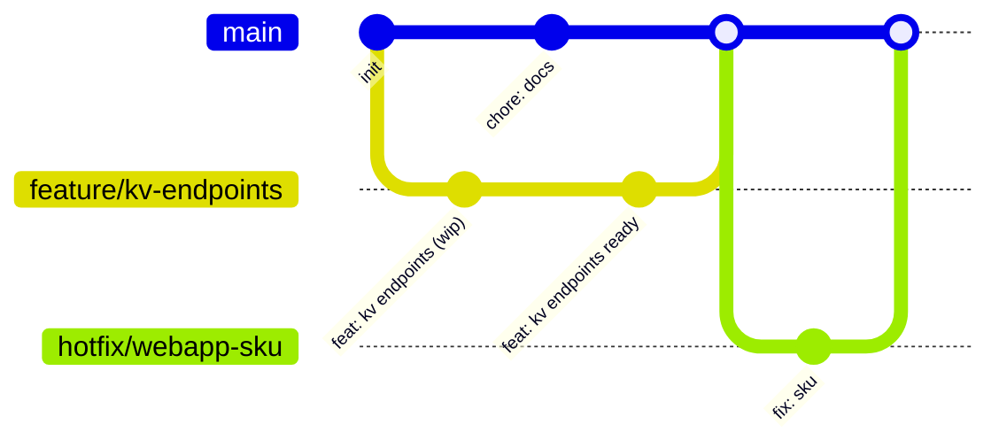

# ARBIT — **Single README** for Terraform + Azure DevOps (ADO) CI/CD (dev · stage · prod)

This document consolidates all guidance into **one file** you can hand to your team. It covers:
- What the pipeline does (PR → Plan; merge → Apply dev; gated stage/prod)
- Exact **ADO setup** (service connections, environments, branch policies)
- **Global variables** to create in ADO (no secrets in code)
- **Secrets** from Azure Key Vault (AKV) with two network patterns (private endpoint vs. temporary IP allow‑listing)
- **Branching strategy**
- **End‑to‑end workflow** with diagrams
- Step‑by‑step **first run**
- Best practices, troubleshooting, and key YAML snippets

> **No secrets in the repository**: all credentials are read from **Azure Key Vault at runtime** via the ADO service connections. Apply uses the **saved plan artifact** only.【F:docs/SECRETS-AKV.md†L4-L80】

---

## 1) TL;DR — How the pipeline behaves

- **PR to `main`** → pipeline runs **Validate + Plan** for **dev, stage, prod**. **No applies** on PR runs.  
- **Merge to `main`** → pipeline runs **Apply_Dev** automatically, then waits for **Environment approvals** to apply to **stage** and **prod**.  
- Secrets are **never** in code; the pipeline reads them from **AKV** during **Plan**, and **Apply** uses the previously saved `.tfplan`.【F:docs/SECRETS-AKV.md†L4-L80】

---

## 2) Repository essentials (where things live)

- `azure-pipelines.yml` — **multi‑stage** pipeline entry (PR → Plan; merge → Apply dev; gated stage/prod).
- `.ado/templates/` — reusable templates (`tf-validate.yml`, `tf-plan.yml`, `tf-apply.yml`).
- `platform/infra/Azure/modules/` — Terraform modules (Resource Group, Key Vault, Logs/AppInsights, WebApp, Functions, Storage, SQL; AKS/ACR optional).
- `platform/infra/envs/{dev,stage,prod}/` — per‑environment Terraform roots (`backend.tfvars`, `terraform.tfvars`, etc.).
- `docs/` — diagrams and guides merged here (this README replaces the separate docs).

---

## 3) One‑time ADO setup

### 3.1 Service connections (OIDC)

Create **three** Azure Resource Manager service connections using **Workload identity federation** (no client secrets):
- `sc-azure-oidc-dev`
- `sc-azure-oidc-stage`
- `sc-azure-oidc-prod`

Grant each **Contributor** on the target scope and **Storage Blob Data Contributor** on the tfstate Storage Account.【F:docs/ADO-setup.md†L4-L12】

### 3.2 Environments & approvals

Create ADO **Environments**: `dev`, `stage`, `prod`.  
Add **Approvals** for `stage` and `prod` (SRE/lead/change approvers). Optionally add **Branch control** to allow only `refs/heads/main`.【F:docs/ADO-setup.md†L11-L15】

### 3.3 Branch policies

Protect `main`: **require PR**, **build validation**, reviewers, and comment resolution.【F:docs/ADO-setup.md†L15-L16】

---

## 4) Global variables to create in ADO (no secrets in code)

Create these as **Pipeline variables** or **Variable Groups**. They are **not** committed to the repo.

### 4.1 Global (non‑secret)

- `TF_VERSION` = `1.7.5`  
- `TF_LOCK_TIMEOUT` = `20m`  
- `USE_AKV_FOR_SECRETS` = `true` (pipeline pulls secrets from AKV during **Plan**)  
- `AKV_SECRET_SQL_ADMIN_LOGIN_NAME` = `sql-admin-login`  
- `AKV_SECRET_SQL_ADMIN_PASSWORD_NAME` = `sql-admin-password`【F:docs/GLOBAL-VARIABLES.md†L5-L10】

### 4.2 Per‑environment (non‑secret)

- `KV_NAME_DEV` = `kv-arbit-dev`  
- `KV_NAME_STAGE` = `kv-arbit-stage`  
- `KV_NAME_PROD` = `kv-arbit-prod`  

- `AKV_ENABLE_DYNAMIC_IP_DEV` = `true`   *(Dev convenience for hosted agents)*  
- `AKV_ENABLE_DYNAMIC_IP_STAGE` = `false`  
- `AKV_ENABLE_DYNAMIC_IP_PROD` = `false`  *(Prefer private endpoint + self‑hosted agents)*【F:docs/GLOBAL-VARIABLES.md†L13-L19】【F:docs/SECRETS-AKV.md†L10-L21】

### 4.3 Optional (for Terraform‑managed RBAC on Key Vault)

- `KV_CICD_PRINCIPAL_ID_DEV` = `<objectId>` *(fake placeholder is fine; update later)*  
- `KV_CICD_PRINCIPAL_ID_STAGE` = `<objectId>`  
- `KV_CICD_PRINCIPAL_ID_PROD` = `<objectId>`  

If you set these, Terraform can grant **Key Vault Secrets User** to the pipeline identity (uncomment the role assignment block in `platform/infra/envs/<env>/main.tf`).【F:docs/GLOBAL-VARIABLES.md†L21-L26】

---

## 5) Secrets & Key Vault (AKV)

### 5.1 Goal

- **No secrets** in repo/YAML. All credentials live in **AKV** and are retrieved at pipeline runtime via **OIDC**.【F:docs/SECRETS-AKV.md†L3-L78】

### 5.2 Two network patterns

**Preferred — Private access**  
- Put AKV behind a **Private Endpoint** in your VNet.  
- Run the pipeline on a **self‑hosted agent** inside that VNet.  
- In AKV, set `public network access = false`.  
- Result: no IP allow‑listing needed.【F:docs/SECRETS-AKV.md†L10-L15】

**Fallback — Public access with temporary IP allow‑listing**  
- Keep `public_network_access_enabled = true`.  
- Set AKV firewall `default_action = "Deny"`; allow selected networks only.  
- The pipeline **detects the agent’s public IP**, **adds** it before secret reads, and **removes** it at the end (trap on exit). Works with Microsoft‑hosted agents.【F:docs/SECRETS-AKV.md†L16-L21】【F:.ado/templates/tf-plan.yml†L65-L88】

### 5.3 Required RBAC

Grant the service principal of your ADO service connection **Key Vault Secrets User** at the vault scope (data‑plane). Optional: **Key Vault Reader** for metadata.【F:docs/SECRETS-AKV.md†L25-L29】

### 5.4 Secret names in AKV

Create per‑environment secrets (names configurable via variables):  
- `sql-admin-login`  
- `sql-admin-password`【F:docs/SECRETS-AKV.md†L65-L67】

> The pipeline passes them to Terraform via `-var "sql_admin_login=..." -var "sql_admin_password=..."` during **Plan**; **Apply** uses the saved plan and does not re‑read secrets.【F:docs/SECRETS-AKV.md†L71-L80】【F:.ado/templates/tf-plan.yml†L78-L94】

---

## 6) Branching strategy (trunk‑based)

- **main** — trunk; merging triggers **Dev apply**. Stage/prod require approvals.  
- **feature/*** — short‑lived branches for features.  
- **hotfix/*** — urgent fixes.  
- **chore/*** — docs/tooling.  
- *(Optional)* release tags for audit.【F:docs/DEV-Deploy-With-Branching.md†L5-L9】


*Diagram source.*【F:docs/DEV-Deploy-With-Branching.md†L11-L26】

---

## 7) End‑to‑end workflow (with diagrams)

### 7.1 High‑level flow

```mermaid
flowchart LR
  subgraph Dev[Developer]
    A[Commit changes<br/>Open PR → main]
  end

  subgraph PRPipe[ADO Pipeline — PR Run]
    V[Stage: Validate<br/><code>fmt</code> + <code>init -backend=false</code> + <code>validate</code>]
    P1[Job: Plan dev<br/>publish <code>tfplan-dev</code>]
    P2[Job: Plan stage<br/>publish <code>tfplan-stage</code>]
    P3[Job: Plan prod<br/>publish <code>tfplan-prod</code>]
  end

  subgraph Review[Reviewers]
    R[Review PR<br/>Review 3 plan artifacts]
  end

  subgraph MainPipe[ADO Pipeline — Main Run]
    V2[Stage: Validate]
    PAll[Stage: Plan_All<br/>Plan dev + stage + prod<br/>publish 3 plan artifacts]
    AD[Stage: Apply_Dev<br/>Auto on main<br/>uses <code>tfplan-dev</code>]
    AS[Stage: Apply_Stage<br/>Waits for approval<br/>uses <code>tfplan-stage</code>]
    AP[Stage: Apply_Prod<br/>Waits for approval<br/>uses <code>tfplan-prod</code>]
  end

  subgraph Approver[Environment Approver(s)]
    SApprove[[Approve Stage]]
    PApprove[[Approve Prod]]
  end

  subgraph Azure[Azure]
    DevRG[(Dev resources updated)]
    StageRG[(Stage resources updated)]
    ProdRG[(Prod resources updated)]
  end

  A --> V --> P1
  V --> P2
  V --> P3
  P1 & P2 & P3 --> R -->|Merge PR| V2
  V2 --> PAll --> AD --> DevRG
  AD --> SApprove --> AS --> StageRG
  AS --> PApprove --> AP --> ProdRG
```
This is the merged overview of the PR and main pipeline runs.【F:docs/README-CI-CD.md†L1-L6】

### 7.2 Developer‑centric (laptop) flow

```mermaid
flowchart TD
  subgraph Dev[Laptop]
    A1[Clone repo]
    A2[Create feature branch]
    A3[Edit dev vars<br/><code>platform/infra/envs/dev/terraform.tfvars</code>]
    A4[Commit & Push]
    A5[Open PR → main]
  end
  subgraph PRPipe[ADO PR Run]
    P1[Validate: fmt + init(-backend=false) + validate]
    P2[Plan dev → artifact <code>tfplan-dev</code>]
    P3[Plan stage/prod → artifacts]
  end
  subgraph MainPipe[ADO Main Run]
    M1[Validate]
    M2[Plan_All → artifacts]
    M3[Apply_Dev (auto) using <code>tfplan-dev</code>]
  end
  subgraph Azure[Azure]
    Z1[(Dev RG + KV + Logs/AppInsights + WebApp + Functions)]
  end
  A1-->A2-->A3-->A4-->A5-->P1-->P2-->P3-->M1-->M2-->M3-->Z1
```
Use this for onboarding and demos.【F:docs/DEV-Deploy-From-Laptop.md†L1-L33】

---

## 8) First‑run setup checklist (15 minutes)

1) **Create service connections (OIDC)**: `sc-azure-oidc-dev`, `sc-azure-oidc-stage`, `sc-azure-oidc-prod`.  
2) **Create ADO Environments**: `dev`, `stage`, `prod` (add approvals for stage/prod).  
3) **Verify backends**: `platform/infra/envs/<env>/backend.tfvars` point to your tfstate and `use_azuread_auth = true`.  
4) **Import pipeline**: point ADO to `azure-pipelines.yml`.  
5) **Open a PR** to test **plans**; **merge** to apply **Dev**; **approve** to promote to **stage/prod**.【F:docs/step-by-step.md†L1-L7】

---

## 9) Developer: Deploy Dev from your laptop

**Path A — Preferred:** *Laptop → PR → ADO auto‑applies Dev after merge* (keeps audit trail).  
**Path B — One‑off:** *Direct local Terraform CLI to Dev* (for bootstrap/emergency).【F:docs/DEV-Deploy-From-Laptop.md†L5-L46】

- Path A Steps: clone → branch → change `platform/infra/envs/dev/terraform.tfvars` → push → PR → review **3 plans** → merge → Dev applies.【F:docs/DEV-Deploy-From-Laptop.md†L5-L33】
- Path B Commands (Linux/Mac):  
  ```bash
  cd platform/infra/envs/dev
  terraform init -reconfigure -backend-config=backend.tfvars
  terraform plan -var-file=terraform.tfvars -out tfplan-dev.tfplan
  terraform apply tfplan-dev.tfplan
  ```
  *(Use only when necessary; pipelines are preferred for audit and promotion.)*【F:docs/DEV-Deploy-From-Laptop.md†L35-L46】

---

## 10) Key YAML guards & integrity

**Apply only on main; never on PRs:**
```yaml
condition: and(
  succeeded(),
  ne(variables['Build.Reason'], 'PullRequest'),
  eq(variables['Build.SourceBranch'], 'refs/heads/main')
)
```

**Plan → Apply the same artifact (no drift):**
- Plan publishes `tfplan-<env>.tfplan`.  
- Apply downloads and applies that **exact** plan file.

**Why this matters:** it enforces change control and auditability.【F:docs/ci-cd-best-practices.md†L1-L5】

---

## 11) CI/CD best practices we enforce

- OIDC service connections (no client secrets).  
- Apply the exact reviewed `.tfplan` artifact.  
- Require PR + build validation to update `main`.  
- Use ADO Environments for approvals on stage/prod.【F:docs/ci-cd-best-practices.md†L1-L5】

---

## 12) What changed & why (from the old structure)

- Modularized Terraform under `platform/infra/Azure/modules`.  
- Per‑env roots with independent state backends.  
- GitOps flow: PR → plan; merge → apply Dev → gated stage/prod.  
- Bash‑only pipelines (no marketplace dependency).【F:docs/what-changed-and-why.md†L1-L5】

---

## 13) Troubleshooting (common)

| Symptom | Likely cause | Fix |
|---|---|---|
| `A required approval is pending` | No one approved the Environment | Approver must approve `stage`/`prod` in **Pipelines → Environments**. |
| `Insufficient privileges to access the Storage Account` | Service connection lacks **Storage Blob Data Contributor** on tfstate SA | Add role assignment on the Storage Account. |
| `Error acquiring the state lock` | Parallel run/lock contention | Re‑run; increase `TF_LOCK_TIMEOUT` to `30m`. |
| `Backend not found` | Wrong RG/SA/container in `backend.tfvars` | Correct names; ensure resources exist. |
| `Provider version` errors | Wrong TF/provider version on agent | Keep `TF_VERSION` pinned; `terraform init -reconfigure`. |
| OIDC login fails | Federated credential mis‑configured | Recreate service connection with **Workload identity federation** (no secrets). |

---

## 14) Security options for AKV networking

- **Stage/Prod**: prefer **Private Endpoint + self‑hosted agent**, set `kv_public_network_access = false`, keep `AKV_ENABLE_DYNAMIC_IP_* = false`.  
- **Dev (hosted agents)**: set `kv_public_network_access = true`, AKV firewall `default_action = "Deny"`, and `AKV_ENABLE_DYNAMIC_IP_DEV = true` so the pipeline **temporarily** allow‑lists the agent’s IP, then **auto‑removes** it.【F:docs/SECRETS-AKV.md†L16-L21】【F:.ado/templates/tf-plan.yml†L65-L88】

---

## 15) Appendix — Complete variable list (quick copy)

**Global**: `TF_VERSION`, `TF_LOCK_TIMEOUT`, `USE_AKV_FOR_SECRETS`, `AKV_SECRET_SQL_ADMIN_LOGIN_NAME`, `AKV_SECRET_SQL_ADMIN_PASSWORD_NAME`  
**Per‑env**: `KV_NAME_DEV|STAGE|PROD`, `AKV_ENABLE_DYNAMIC_IP_DEV|STAGE|PROD`  
**Optional**: `KV_CICD_PRINCIPAL_ID_DEV|STAGE|PROD` (for TF‑managed Key Vault RBAC)【F:docs/GLOBAL-VARIABLES.md†L21-L24】

---

### You’re ready ✅

- Point ADO → Pipelines → New → Existing YAML → `azure-pipelines.yml`.  
- Create the variables above.  
- Open a small PR → review 3 plans → merge → Dev applies → approve to promote.
