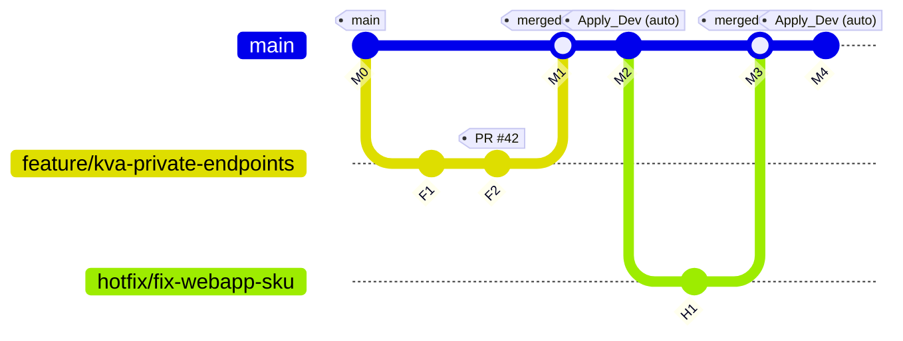

# ARBIT Terraform CI/CD on **Azure DevOps** — How the Pipeline Works

This document explains **how our Azure DevOps (ADO) CI/CD YAML works**, step‑by‑step, so anyone on the team can run and maintain it confidently. It covers triggers, stages, approvals, promotion to environments, artifact handling, and common troubleshooting.

---

## TL;DR

- **PR to `main`** → pipeline runs **Validate + Plan** for **dev, stage, prod** (no applies).  
- **Merge to `main`** → **Apply dev** automatically.  
- **Stage** and **Prod** applies are **gated by Environment approvals** (in ADO → *Pipelines → Environments*) **in addition** to PR review.  
- The pipeline **applies the exact `.tfplan` artifact** that was generated earlier, ensuring the code reviewed is exactly what gets deployed.

> The pipeline is implemented in **Bash-only** using `AzureCLI@2` (no Terraform marketplace tasks). The multi-stage pipeline lives at `azure-pipelines.yml` and composes the reusable building blocks under `.ado/templates/*`.

---

## Repository Layout (CI/CD‑related)

```
azure-pipelines.yml                  # Multi-stage pipeline (entry point)  ← Use this
.ado/
  templates/
    tf-validate.yml                 # fmt + init/validate (parameter: envName)
    tf-plan.yml                     # plan (publishes tfplan-<env>.tfplan artifact)
    tf-apply.yml                    # apply reviewed plan (deployment job + approvals)

platform/infra/
  Azure/modules/*                   # Terraform modules (RG, KV, Logs/AppInsights, WebApp, FunctionApp, etc.)
  envs/
    dev/                            # Terraform root for dev (independent backend & tfvars)
      backend.tfvars
      terraform.tfvars
      ...
    stage/
      backend.tfvars
      terraform.tfvars
      ...
    prod/
      backend.tfvars
      terraform.tfvars
      ...
```

---

## Prerequisites (one-time ADO setup)

1. **Service Connections (OIDC)**  
   Create 3 **Azure Resource Manager(App-Registration)** service connections using **Workload identity federation**:
   - `sc-azure-oidc-dev`
   - `sc-azure-oidc-stage`
   - `sc-azure-oidc-prod`  
   Scope each to the target subscription/RG and also grant **Storage Blob Data Contributor** on the Terraform **state** Storage Account.

2. **ADO Environments**  
   Create **Environments** named `dev`, `stage`, `prod`.  
   - Add **Approvals** to `stage` & `prod` (e.g., SRE/Lead/Change Manager).  
   - (Optional) Add **Branch control** check to only allow `refs/heads/main`.  
   - (Optional) Add **Business hours** check for `prod`.

3. **Remote state**  
   Each env root has a `backend.tfvars` file (already committed) that points to the tfstate RG/Storage/Container and sets `use_azuread_auth = true` (for OIDC). Adjust names if your tfstate resources differ.

4. **Branch policy**  
   In *Repos → Branches → `main` → Branch policies*:
   - Require PR (no direct push).
   - Require build validation (this pipeline for PRs).
   - Require ≥ N reviewers; require comment resolution.

---

## What the Pipeline Actually Does

### Triggers
- **PR to `main`**: runs **Validate** and **Plan_All** stages. It **does not** run any Apply stages.
- **Push/Merge to `main`**: runs **Validate** → **Plan_All** → **Apply_Dev** → (with approvals) **Apply_Stage** → **Apply_Prod**.

> Every Apply stage has strict conditions:
> - Not a PR (`Build.Reason` != `PullRequest`)
> - Must be on `refs/heads/main`  
> This prevents “click → deploy to prod” from feature branches or PR validation runs.

### Stages & Jobs

1. **Validate**  
   - Installs Terraform (v1.7.5), runs `terraform fmt -check -recursive` over `platform/infra`, then `init -backend=false` and `validate` on the **dev** root.  
   - Purpose: catch formatting and config errors early; uses dev root as a schema proxy for providers/versions.

2. **Plan_All**  
   - Three independent jobs: **plan_dev**, **plan_stage**, **plan_prod**.  
   - For each job:
     1. Sign in to Azure via the env’s **OIDC service connection**.
     2. `terraform init -reconfigure -backend-config=backend.tfvars` (env’s backend) with lock timeout.  
     3. `terraform plan -var-file=terraform.tfvars -out tfplan-<env>.tfplan`  
     4. Publish the plan file as a **Pipeline Artifact** named `tfplan-<env>`.

   > Results: Your PR shows three separate plans. Review them before merging.

3. **Apply_Dev** (auto after merge to `main`)  
   - Condition: success, not PR, branch == `refs/heads/main`.  
   - Downloads the **exact** `tfplan-dev.tfplan` artifact produced earlier in this run.  
   - Re-runs `init` against the **same backend** and executes `terraform apply <plan>`.

4. **Apply_Stage** (requires Environment approval)  
   - Same as dev apply, but uses `tfplan-stage.tfplan`.  
   - Uses **Environment: `stage`** → approvers must approve before steps run.

5. **Apply_Prod** (requires Environment approval)  
   - Same as stage, but uses `tfplan-prod.tfplan`.  
   - Uses **Environment: `prod`** → approvers must approve.

### Why we apply the **plan artifact**

- It guarantees the **reviewed plan** is what gets applied; no hidden drifts between plan and apply.  
- If you re-run just the Apply stage, it still uses the saved artifact from the same pipeline run, keeping integrity.

---

## Configuration (what you can safely change)

| Setting | Where | Notes |
|---|---|---|
| Terraform version | `TF_VERSION` variable in YAML | Default `1.7.5`. Update once; all jobs use it. |
| Lock timeout | `TF_LOCK_TIMEOUT` | Default `20m`; increase if state lock contention occurs. |
| Service connections | YAML params in plan/apply templates | Rename to match your ADO connections. |
| Feature toggles | `platform/infra/envs/<env>/terraform.tfvars` | `enable_storage`, `enable_sql`, `kv_public_network_access`, etc. AKS/ACR are off by default. |
| Backend coordinates | `platform/infra/envs/<env>/backend.tfvars` | Update RG/Storage/Container names if your tfstate storage differs. |
| SQL secrets (optional) | ADO Variable Groups | Create `vg-arbit-<env>-secrets` with `sqlAdminLogin`, `sqlAdminPassword`; pass via `extraVarFlags` in `tf-plan.yml`. |

**Passing SQL secrets example (optional):**
```yaml
# In a pipeline stage that includes the plan template
- template: .ado/templates/tf-plan.yml
  parameters:
    envName: stage
    serviceConnection: sc-azure-oidc-stage
    extraVarFlags: >
      -var "sql_admin_login=$(sqlAdminLogin)"
      -var "sql_admin_password=$(sqlAdminPassword)"
```

---

## How Promotion & Approvals work

1. Developer opens **PR → main**. Pipeline runs **Validate + Plan**; reviewers inspect **three plan artifacts**.
2. PR gets approved and merged. Pipeline runs **Apply_Dev** automatically.
3. To promote, **Approver** opens pipeline run → **Stages** → clicks **Review** for `stage`, and then for `prod`.  
   - You can require multiple approvers, enforce business hours, or limit to `refs/heads/main` via environment checks.
4. Stage/Prod apply uses the **exact plan artifact** from the same run.

> **Tip:** If you need to “pause” between stage and prod, simply **do not approve** prod. The approvals window keeps the run waiting until approved or timed out per your policy.

---

## Manual runs & re-runs

- **Run pipeline** on `main`: behaves like a merge to `main` (applies dev, then waits for stage/prod approvals).  
- **Re-run failed jobs**: you can retry stages. Applies will still use the saved `tfplan-<env>.tfplan` artifacts.  
- **Redeploy**: from the *Environments* page, you can redeploy the last successful run of an environment; it will use the last plan/artifact from that run.

---

## Rollback Strategy

Terraform doesn’t “roll back”; you **roll forward** with another change. Options:

1. **Revert commit** that introduced a bad change → open PR → review plans → merge → re-apply dev → approve stage/prod.  
2. **Hotfix branch** that restores the previous desired state → PR → same flow.  
3. **Targeted apply** (advanced): in emergencies you can temporarily use `-target` in the plan template to focus on a resource; remove afterward.  
4. **Destroy**: Keep a **separate, manual destroy pipeline** (not included by default) that requires parameters + approvals + special permissions.

---

## Security & Governance

- **OIDC** service connections (no client secrets).  
- **Least privilege**: scope service connections to the smallest subscription/RG needed.  
- **Environment approvals**: enforce separation of duties for stage/prod.  
- **Branch policies**: PR reviews + build validation required to change infra.  
- **Pipeline permissions**: in Service connection security, disable “Allow all pipelines to use this connection”; authorize only this pipeline.  
- **Secrets**: store credentials in **Variable Groups** or **Key Vault**; reference via pipeline variables.  
- **Auditability**: plan artifacts and deployment logs provide a full audit trail of what was reviewed and applied.

---

## Troubleshooting

| Symptom | Likely cause | Fix |
|---|---|---|
| `A required approval is pending` | No one approved the Environment | Approver must approve the `stage`/`prod` Environment in ADO. |
| `Insufficient privileges to access the Storage Account` | Service connection lacks **Storage Blob Data Contributor** on tfstate SA | Grant role to the service principal used by the service connection. |
| `Error acquiring the state lock` | Concurrent run or lock not released | Wait/retry; increase `TF_LOCK_TIMEOUT` to 30m if needed. |
| `Backend not found` | Wrong RG/SA/container in `backend.tfvars` | Correct names; ensure resources exist. |
| `Provider version` errors | Agent downloads wrong TF or provider | Keep `TF_VERSION` pinned; run `terraform init -reconfigure`. |
| OIDC login fails | Federated credential claims mismatch | Recreate service connection with Workload Identity and correct repo/project mapping. |

---

## Appendix — Key YAML Guards (snippets)

**Apply only on `main`, not on PRs:**
```yaml
condition: and(
  succeeded(),
  ne(variables['Build.Reason'], 'PullRequest'),
  eq(variables['Build.SourceBranch'], 'refs/heads/main')
)
```

**Plan: publish the plan as an artifact (dev example):**
```yaml
terraform plan -input=false -var-file=terraform.tfvars \
  -out "$BUILD_SOURCESDIRECTORY/tfplan-dev.tfplan"
# then PublishPipelineArtifact@1 → artifact name: tfplan-dev
```

**Apply: use the exact reviewed plan (dev example):**
```bash
PLAN_PATH="$(Pipeline.Workspace)/plans/dev/tfplan-dev.tfplan"
terraform apply -input=false -auto-approve "${PLAN_PATH}"
```

---

## Who to contact

- Infra ownership: Platform/DevOps team  
- Approvals: Stage/Prod approver groups (SRE, Tech Leads, Change Control)  
- Secrets management: Variable Groups & Key Vault admins

Heree is/are steps, how to deploy from your work laptop to the Azure Developer Environment:

# Deploy to **Dev** with Branching — ADO Terraform CI/CD (Laptop → PR → Dev)

This guide adds a **branching model** to the earlier Dev deployment flow. It shows how you work from your **laptop** on a short‑lived branch, open a **PR → `main`**, and let **ADO** apply to **Dev** automatically after merge. Stage/Prod remain gated by **Environment approvals**.

---

## Recommended Branching Model (Trunk‑based)

- **`main`**: the single trunk. Merging to `main` triggers the pipeline to **apply Dev** automatically, then waits for approvals to promote to **stage** and **prod**.
- **`feature/*`**: short‑lived branches for planned work (e.g., `feature/kva-private-endpoints`).
- **`hotfix/*`**: urgent fixes (e.g., `hotfix/fix-webapp-sku`).
- **`chore/*`**: tooling, docs, refactors (e.g., `chore/rename-tags`).

**Naming:** `feature/<desc>`, `hotfix/<desc>`, `chore/<desc>` (lower‑kebab‑case).  
**Policy:** Only PRs can update `main` (branch protection).

> Optional: create **release tags** (e.g., `v2025.09.02`) for audit/bookkeeping. They don’t change pipeline gating (stage/prod still need approvals).

---

## Git History — Branching View



**Legend**
- PRs from **feature/** and **hotfix/** merge into **main**.
- Each merge to **main** triggers: Validate → Plan_All → **Apply_Dev (auto)** → wait for stage/prod approvals.

---

## End‑to‑End Flowchart (with Branches)

```mermaid
flowchart TD
  %% Lanes
  subgraph Laptop[Developer Laptop]
    L1[Pull latest from main]
    L2[Create branch<br/><code>feature/...</code> or <code>hotfix/...</code>]
    L3[Edit Terraform: <code>platform/infra/envs/dev/terraform.tfvars</code> etc.]
    L4[Commit & Push branch]
    L5[Open PR → main]
  end

  subgraph PRPipe[ADO Pipeline — PR Run]
    P1[Stage: Validate<br/>fmt + init(-backend=false) + validate]
    P2[Job: Plan dev → publish <code>tfplan-dev</code>]
    P3[Jobs: Plan stage & prod → publish artifacts]
  end

  subgraph Review[Reviewers]
    R1[Review PR + 3 plan artifacts<br/>Approve PR]
  end

  subgraph MainPipe[ADO Pipeline — Main Run]
    M1[Stage: Validate (main)]
    M2[Stage: Plan_All (main)]
    M3[Stage: Apply_Dev (auto)<br/>uses <code>tfplan-dev</code>]
    M4[Stage: Apply_Stage (approval)<br/>uses <code>tfplan-stage</code>]
    M5[Stage: Apply_Prod (approval)<br/>uses <code>tfplan-prod</code>]
  end

  subgraph Azure[Azure]
    ADev[(Dev resources updated)]
    AStage[(Stage resources updated)]
    AProd[(Prod resources updated)]
  end

  L1-->L2-->L3-->L4-->L5-->P1-->P2-->P3-->R1-->M1-->M2-->M3-->ADev
  M3-->|Request approval|M4-->AStage
  M4-->|Request approval|M5-->AProd
```

---

## Sequence Diagram (Branch + Pipeline Signals)

```mermaid
sequenceDiagram
  autonumber
  participant Dev as Laptop (feature/* or hotfix/*)
  participant ADO as ADO Pipeline
  participant Env as Environment Approvers
  participant Az as Azure

  Dev->>ADO: Open PR to main
  ADO->>ADO: Validate (fmt + init -backend=false + validate)
  ADO->>ADO: Plan dev/stage/prod (publish tfplan artifacts)
  ADO-->>Dev: PR shows 3 plans
  Dev->>ADO: Merge PR to main
  ADO->>ADO: Validate (main)
  ADO->>ADO: Plan_All (main)
  ADO->>Az: Apply_Dev (auto; uses tfplan-dev)
  ADO->>Env: Request Stage approval
  Env-->>ADO: Approve Stage
  ADO->>Az: Apply_Stage (uses tfplan-stage)
  ADO->>Env: Request Prod approval
  Env-->>ADO: Approve Prod
  ADO->>Az: Apply_Prod (uses tfplan-prod)
```

---

## Step‑by‑Step: Deploy **Dev** from your Laptop (via PR)

> **Prereqs:** Service connection `sc-azure-oidc-dev`, ADO Environment `dev`, and the tfstate backend exist.

1. **Create a branch**
   ```bash
   git fetch origin
   git checkout main
   git pull --ff-only
   git checkout -b feature/<short-desc>
   ```

2. **Make your change (Dev env)**
   - Edit **`platform/infra/envs/dev/terraform.tfvars`** (feature toggles, SKUs, tags).
   - If module changes, keep them isolated and keep `providers.tf`/`versions.tf` consistent.

3. **Commit & push**
   ```bash
   git add -A
   git commit -m "infra(dev): <what-and-why>"
   git push -u origin feature/<short-desc>
   ```

4. **Open PR → `main`**
   - PR title: `infra(dev): <what>`
   - Describe *why* and any risk/rollback.
   - The PR pipeline runs **Validate + Plan_All**; check **Artifacts**: `tfplan-dev`, `tfplan-stage`, `tfplan-prod`.

5. **Review & merge**
   - Reviewers approve after reading the plans.
   - Merge PR to **`main`** (branch policy enforced).

6. **Let ADO apply Dev**
   - Main pipeline runs and **auto‑applies Dev** using the fresh `tfplan-dev.tfplan`.
   - Watch **Apply_Dev** stage logs.

7. **Verify in Azure**
   - Resource group: `rg-arbit-dev`
   - KV: `kv-arbit-dev`
   - AppInsights/Logs: `appi-arbit-dev` / `log-arbit-dev`
   - Web App: `app-halomdweb-dev`
   - Function Apps: `func-external-dev`, `func-cron-dev`

> **Hotfix path:** Same steps, but branch name starts with `hotfix/`. Turn small, focused fixes quickly with the same guardrails.

---

## Guardrails that keep Prod safe

- **Branch policy**: only PRs can update `main` (build validation required).
- **Apply stages** guarded by YAML:
  ```yaml
  condition: and(
    succeeded(),
    ne(variables['Build.Reason'], 'PullRequest'),
    eq(variables['Build.SourceBranch'], 'refs/heads/main')
  )
  ```
- **Environment approvals** for `stage` and `prod`: apply pauses until approvers click **Review → Approve**.

---

## Optional Variants

- **Release tagging**: add a tag (e.g., `vYYYY.MM.DD`) after merge for bookkeeping; the pipeline behavior doesn’t change (still gated by approvals).  

---

*End of guide.*
