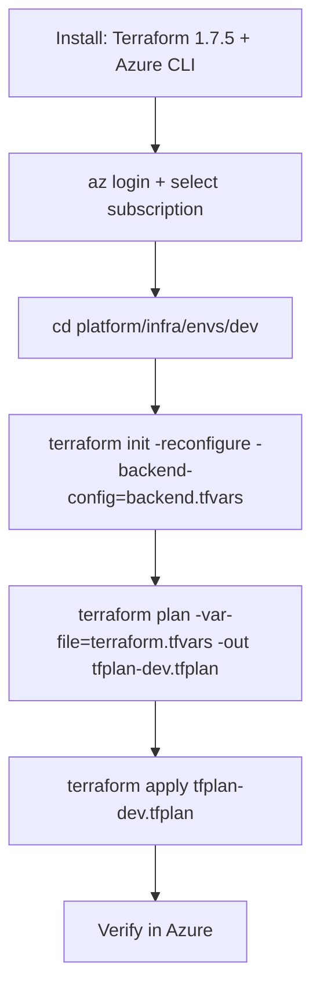

# Deploy Terraform to **Dev** from Your Work Laptop

Two ways:

- **Path A — Preferred:** *Laptop → PR → ADO auto‑applies Dev after merge.*
- **Path B — Direct CLI:** Local `terraform` to Dev (bootstrap/emergency only).

## Path A — Flow

```mermaid
flowchart TD
  subgraph Dev[Laptop]
    A1[Clone repo]
    A2[Create feature branch]
    A3[Edit dev vars<br/><code>platform/infra/envs/dev/terraform.tfvars</code>]
    A4[Commit & Push]
    A5[Open PR → main]
  end
  subgraph PRPipe[ADO PR Run]
    P1[Validate: fmt + init(-backend=false) + validate]
    P2[Plan dev/qa → artifacts <code>tfplan-dev</code>, <code>tfplan-qa</code>]
    P3[Plan stage/prod → artifacts]
  end
  subgraph MainPipe[ADO Main Run]
    M1[Validate]
    M2[Plan_All → artifacts]
    M3[Apply_Dev (auto) using <code>tfplan-dev</code>]
    M4[Apply_QA (auto) using <code>tfplan-qa</code>]
  end
  subgraph Azure[Azure]
    Z1[(Dev RG + KV + Logs/AppInsights + WebApp + Functions)]
    Z2[(QA RG + KV + Logs/AppInsights + WebApp + Functions)]
  end
  A1-->A2-->A3-->A4-->A5-->P1-->P2-->P3-->M1-->M2-->M3-->M4-->Z1
  M4-->Z2
```

## Path B — Local CLI to Dev


