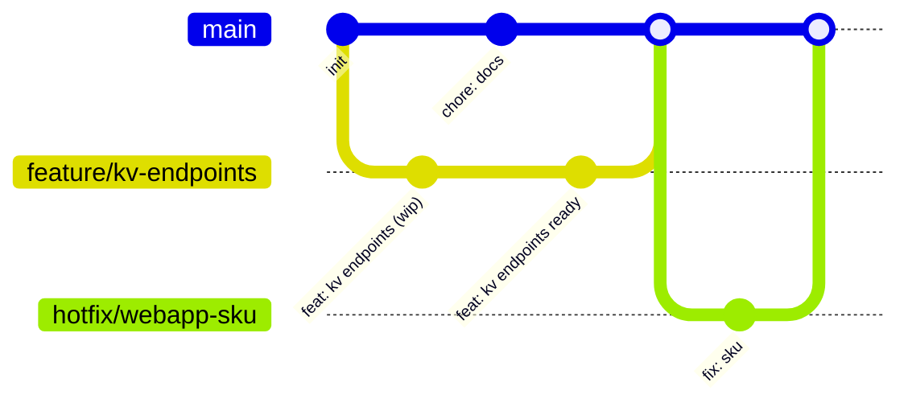

# Dev Deployment with **Branching Strategy**

We use **trunk‑based development**:

- **main** — trunk; merging triggers Dev & QA apply; stage/prod need approvals.
- **feature/*** — short‑lived branches for features.
- **hotfix/*** — urgent fixes.
- **chore/*** — docs/tooling.
- Optional: release tags.

